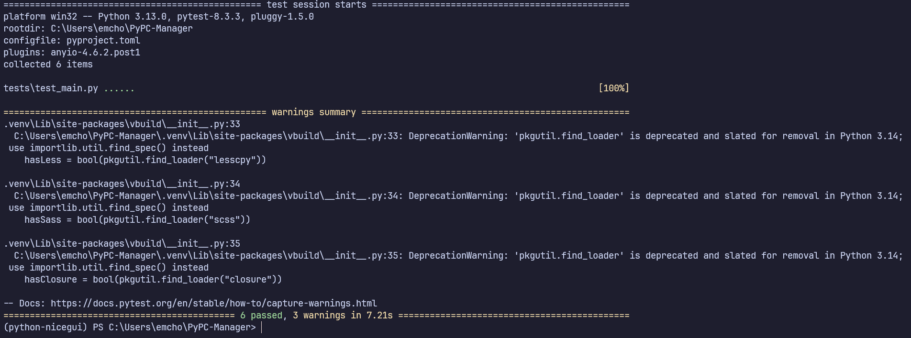

# Sadržaj

- [PyPC Manager](#pypc-manager)
- [Predrekvizite](#predrekvizite)
  - [uv](#uv)
  - [git](#git)
  - [nicegui](#nicegui)
- [Upotreba projekta](#upotreba-projekta)
- [Pokretanje projekta](#pokretanje-projekta)
- [Testiranje projekta](#testiranje-projekta)
- [Tema](#tema)

# PyPC Manager

PyPC Manager je projekat usmjeren na praćenje osnovnih informacija o računarskom sistemu, uključujući upotrebu CPU-a, RAM-a i diska.

Ovaj alat omogućava korisnicima da dobiju uvid u performanse svog sistema u stvarnom vremenu, što je ključno za optimizaciju resursa i identifikaciju potencijalnih problema.

## Predrekvizite

Za instalaciju i upotrebu ovog projekta potrebni su sledeći alati:

- [uv](https://github.com/astral-sh/uv) - Instalira Python ako nema već u sistemu
- [git](https://git-scm.com/downloads) - Potreban za kloniranje projekta
- [nicegui](https://nicegui.io) - Biblioteka za izradu aplikacije

### Sva uputstva za instalaciju potrebnih alata nalaze se unutar web stranica!

## Upotreba projekta 

Da biste klonirali repozitorij, koristite sledeću komandu:

```bash
git clone https://github.com/Emcho0/PyPC-Manager
```

## Upotreba projekta 

Uđite u direktorij gdje se nalazi projekat i sinhronizujte ga

```bash
cd python_nicegui
uv sync
```

## Pokretanje projekta 

Pokrenite projekat jednostavno preko komande ispod:

```bash
uv run src/main.py 
```

## Testiranje projekta



###### Tema koja je upotrijebljena za projekat [yorumi](https://github.com/yorumicolors)
