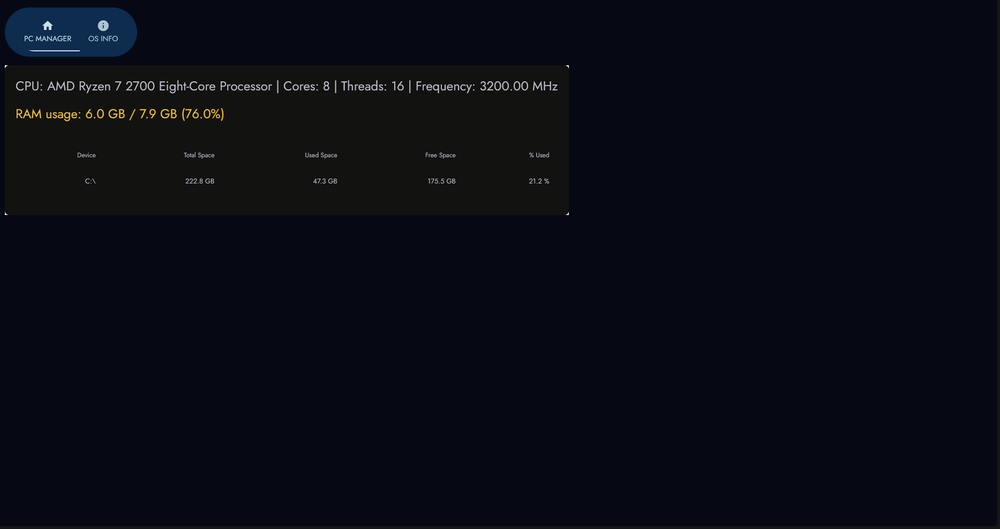

# PyPC Manager

**Datum izrade**: 28.10.2024

## Kratak opis projekta

PyPC Manager je projekat koji omogućava praćenje osnovnih informacija o računarskom sistemu, uključujući upotrebu CPU-a, RAM-a i diska. Alat pruža uvid u performanse sistema u stvarnom vremenu, što je korisno za optimizaciju resursa i identifikaciju potencijalnih problema.

